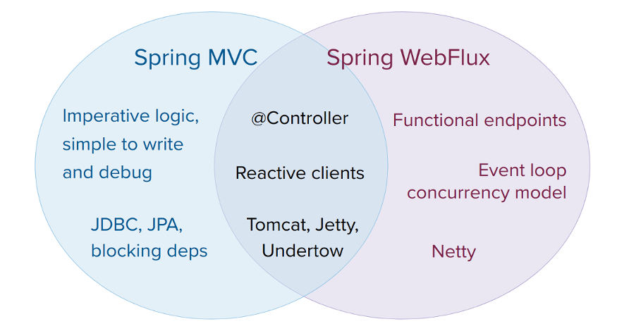

# Spring WebFlux

- Overview
- Reactive Core
- DispatcherHandler
- Annotated Controllers
- Functional Endpoints
- URI Links
- CORS
- Error Responses
- Web Security
- HTTP Caching
- View Technologies
- WebFlux Config
- HTTP/2

---

## Overview

- Spring WebFlux 탄생 배경 1. non-blocking web stack으로 동시성을 제어하기 위함 (적은 스레드, 작은 하드웨어 사용)
    - Servlet blocking I/O는 synchronous (`Filter`, `Servlet`), blocking I/O (`getParameter()`, `getPart()`)
    - Netty는 asynchronous, non-blocking I/O 서버
- Spring WebFlux 탄생 배경 2. functional programming을 지원
    - Java 5의 REST controller, unit test
    - Java 8의 lambda, Stream API
    - Java 8부터 Spring WebFlux를 통해 주석으로 functional web endpoints를 지원

### Define “Reactive” : non-blocking, funcitonal의 의미

- reactive : 변화에 반응하는 프로그래밍 모델
    - e.g. I/O 이벤트를 감지하는 네트워크 컴포넌트, 사용자 입력에 반응하는 UI 컴포넌트
    - non-blocking은 reactive : blocking 하는 대신 작업이 완료되거나 데이터가 사용 가능할 때 작업
- non-blocking back pressure
    - synchronous & imperative 코드에서는 호출자가 blocking 되면서 back pressure 구현이 필요 없음
    - non-blocking에서는 producer가 consumer에게 데이터를 보내는 속도를 제어해야 함
- Reactive stream : asynchronous 컴포넌트를 back pressure로 제어하는 작은 spec (Java 9)
    - subscriber가 publisher의 데이터 속도를 제어하기 위함
    - data repository를 퍼블리셔로서 데이터를 생산하면 Http server가 구독자로서 데이터를 응답으로 작성

### Reactive API

#### Reactor library

- reactive library Reactor는 Spring WebFlux의 기반이 되는 reactive API를 제공
- `Mono`는 0...1개의 데이터를 비동기적으로 처리하는 API, `Flux`는 0...N개의 데이터를 비동기적으로 처리하는 API
- non-blocking I/O, backpressure 처리를 지원
- Spring과 함꼐 진화중

#### webflux + coroutines API

- webflux는 coroutines API를 지원

### Programming Model

- `spring-web` 모듈에 Spring WebFlux의 기반이 되는 리액티브 요소들이 있음
- 2가지 선택 모델을 제공
- Annotated Controllers : Spring MVC와 유사한 방식으로 `spring-web` 모듈의 어노테이션 사용
    - Spring MVC, WebFlux 모두 리액티브 반환 타입 지원 (`Reactor`, `RxJava`,)
    - WebFlux는 리액티브 `@RequestBody` 지원
- [webflux-fn] : 람다 기반의 경량, 함수형 프로그래밍 모델
    - 라우팅, 요청을 핸들링
    - 애플리케이션이 처음부터 끝까지 요청 처리를 직접 담당

### Applicability : Spring MVC? Spring WebFlux?



- 둘은 함께 사용함으로서 옵션을 확장할 수 있음
- 같이 사용하면서 양쪽의 장점 취득 가능
- Spring MVC로 잘 작동한다면 바꿀 필요 없음
    - imperative 가 가독성이 좋고 쓰기 쉽고 디버깅이 쉬움
    - 라이브러리가 blcoking 쪽이 훨씬 풍부
- non-blocking web stack을 찾는다면 Spring WebFlux 사용
    - 다양한 서버 지원 : Netty, Tomcat, Jetty, Servlet containers, ...
    - 다양한 프로그래밍 모델 지원 : annotated controllers, functional endpoints
    - 다양한 리액티브 라이브러리 지원 : Reactor, RxJava, ...
- Java 8, kotlin을 사용해서 경량 web framework를 찾는다면 Spring WebFlux 사용
    - 작은 애플리케이션, 마이크로 서비스에 적합
- JPA, JDBC와 같은 blocking API를 사용한다면 Spring MVC가 최선
    - Reactor, RxJava에서도 분리된 스레드를 통해 blcoking API를 사용할 수 있지만, Spring MVC가 더 쉬움
- Spring MVC에서 remote service 호출 시 reactive `WebClient` 사용 고려
    - 컨트롤러에서 직접 리액티브 타입 반환
    - remote service 호출시 대기시간이 길수록 효과 좋음
- non-blocking, functional, declarative 프로그래밍의 러닝 커브 고려
    - reactive `WebClient` 를 사용해 작은 변화부터 시도
    - non-blocking I/O가 어떤 효과가 있는지 사전에 이해하는게 중요 e.g. 동시성, 싱글-스레드 Node.js

### Servers

- Tomcat, Jetty, Servlet container 사용 가능
- Netty, Undertow 같은 비 Servlet container 사용 가능
- 빌트인으로 server를 시작,종료 불가
    - SPring 설정으로 server를 시작,종료 코드 삽입
- Webflux starter로 자동화 가능 (기본으로 Netty 사용, Tomcat, Jetty 등으로 변경 가능)
    - Netty가 비동기, non-blocking 분야에서 가장 널리 사용됨
- Tomcat, Jetty는 Spring MVC에서도 사용되나 서로 다르게 사용됨
    - Spring MVC는 Servlet blocking I/O에 의존, Servlet API를 애플리케이션이 직접 사용
    - Spring WebFlux는 Servlet non-blocking I/O에 의존, Servlet API를 애플리케이션이 직접 사용하지 않음

### Performance

- Reactive, non-blocking은 성능 향상을 위한 것이 아님 (향상해주지 않음)
- 고정된 적은 스레드, 메모리로 확장성을 가질 수 있음
- network I/O wait이 길거나, 예측할 수 없는 경우가 많을떄 성능 향상 가능

### Concurrency Model

- 스레드를 블로킹하는 기본행위에 대한것이 Spring MVC와 가장 다름
- Spring MVC (servlet application) : 애플리케이션이 현재 스레드를 blocking 하면서 대기
    - 따라서 매우 큰 스레드풀을 준비해 놓아야 함
- Spring WebFlux (non-blocking server) : 애플리케이션이 현재 스레드를 blocking 하지 않음
    - 따라서 작고 고정된 스레드풀 (event loop workers)로 요청 처리 가능

#### Invoking a Blocking API

- `publishOn`으로 blcoking 라이브러리 사용
- 다른 스레드에서 계속 연산을 진행하라는 의미

#### Mutable State

- Reactor, RxJava에서는 operator로 로직을 선언
- 런타임에 reactive 파이프라인이 형성되어 데이터가 별도의 스테이지를 시퀀셜하게 흐름
- 애플리케이션이 가변상태를 보호할 필요 없음 (파이프라인이 절대 동시 실행되지 않음)

#### Threading Model

- vanilla Spring WebFlux server
    - 서버를 위한 스레드 1
    - 요청을 처리하는 스레드 N (전형적으로 CPU 코어 수만큼)
    - servlet container를 사용한 경우 blocking, non-blocking 모두 지우너을 위해 더 많은 스레드로 시작 e.g. tomcat 10개
- reactive WebClient는 event loop 스타일로 연산함
    - 적고 고정된 수의 스레드로 요청을 처리함 e.g. `reactor-http-nio-{n}`
    - Reactor Nettyfmf client, server 양쪽에서 사용한다면, 양쪽이 하나의 event loop을 공유함
- Reactor, RxJava는 scheduler라 불리는 스레드 풀 추상화 제공
    - `publishOn`으로 분리된 스레드플로 전환 가능
    - shceduler parallel : CPU 위주의 작업을 위한 고정된 스레드들
    - scheduler elastic : I/O 위주의 작업을 위한 큰 숫자의 스레드들
- 데이터 액세스, 기타 용도로 자체 스레드 생성, 사용 가능

#### Configuring

## Reactive Core

- server request processing
    - `HttpHandler` : non-blocking I/O, Reactive Streams back pressure를 사용해 request 처리
    - `WebHandler` API : request 처리를 위한 고수준의 web API, annotated controller, functional endpoint를 프로그래밍
- client side
    - `ClientHttpConnector` : HTTP client를 위한 non-blocking I/O, Reactive Streams back pressure를 사용해 request 처리
        - `Reactor Netty`, reactive `Jetty HttpClient`, `Apache HttpComponents` 등
        - 고수준의 `WebClient` 가 기본적으로 사용됨
- `codecs` :  Http 요청, 응답 본문을 (역)직렬화 하는데 사용

### HttpHandler

- request/response 처리를 위한 간단한 adapter
- 다른 HTTP server API에 대한 최소한의 추상화
- Servlet Contianer에 WAR로 배포시
    - `AbstractReactiveWebInitializer`를 상속받아 WAR에 포함
    - 해당 상속 클래스가 `ServletHttpHandlerAdapter` 를 사용해 `HttpHandler`를 `Servlet`으로 등록

```kotlin
// Reactor Netty
val handler: HttpHandler = ...
val adapter = ReactorHttpHandlerAdapter(handler)
HttpServer.create().host(host).port(port).handle(adapter).bindNow()

// Undertow
val handler: HttpHandler = ...
val adapter = UndertowHttpHandlerAdapter(handler)
val server = Undertow.builder().addHttpListener(port, host).setHandler(adapter).build()
server.start()

// Tomcat
val handler: HttpHandler = ...
val servlet = TomcatHttpHandlerAdapter(handler)

val server = Tomcat()
val base = File(System.getProperty("java.io.tmpdir"))
val rootContext = server.addContext("", base.absolutePath)
Tomcat.addServlet(rootContext, "main", servlet)
rootContext.addServletMappingDecoded("/", "main")
server.host = host
server.setPort(port)
server.start()

// Jetty
val handler: HttpHandler = ...
val servlet = JettyHttpHandlerAdapter(handler)

val server = Server()
val contextHandler = ServletContextHandler(server, "")
contextHandler.addServlet(ServletHolder(servlet), "/")
contextHandler.start();

val connector = ServerConnector(server)
connector.host = host
connector.port = port
server.addConnector(connector)
server.start()
```

### WebHandler API

- `org.springframework.web.server` 패키지 : 일반적인 웹 API를 제공
    - 여러개의 `WebExceptionHandler`, `WebFilter` 체인, 하나의 `WebHandler`로 구성
- `WebHttpHandlerBuilder` 와 체인을 함께 스프링 `ApplicationContext`에 놓을 수 있음
- 제공 기능
    - 사용자 세션, attribute
    - request attribute
    - 요청에 대한 `Locale` or `Principal` 설정
    - 파싱, 캐싱된 form data 에 접근
    - multipart data 추상화
    - ...

#### Special bean types

`WebHttpHandlerBuilder`가 자동으로 Spring ApplicationContext에 등록하는 특별한 bean 타입들

https://docs.spring.io/spring-framework/reference/web/webflux/reactive-spring.html#webflux-web-handler-api-special-beans

#### Form Data

form data에 접근하기위해 `ServerWebExchange.getFormData()`를 사용

```kotlin
suspend fun getFormData(): MultiValueMap<String, String>
```

- `DefaultServerWebExchange`은 `HttpMessageReader`를 사용해서 `application/x-www-form-urlencoded`를 `MultiValueMap`으로 파싱
- 디폴트로 `FormHttpMessageReader`를 `ServerCodecConfigurer`에 등록

#### Multipart Data

`ServerWebExchange.getMultipartData()`를 사용

```kotlin
suspend fun getMultipartData(): MultiValueMap<String, Part>
```

- `DefaultServerWebExchange`은 `HttpMessageReader`를 사용해서 `multipart/form-data`, `multipart/mixed`, `multipart/related`
  를 `MultiValueMap`으로 파싱
- 디폴트로 `DefaultPartHttpMessageReader`, `SynchronossPartHttpMessageReader`로 대체 가능

#### Forwarded Headers

#### Non-standard Headers

#### ForwardedHeaderTransformer

#### Security Considerations

### Filters

### Exceptions

### Codecs

- `spring-web`, `spring-core` 모듈은 byte content 를 직렬화(역)하는 기능을 고수준으로 제공
- `Encoder`, `Decoder` : HTTP와 관계없이 저수준으로 (역)직렬화
- `HttpMessageReader`, `HttpMessageWriter` : HTTP 요청, 응답 본문을 직렬화(역)하는 기능을 제공
- `Encoder`는 `EncoderHttpMessageWriter`로, `Decoder`는 `DecoderHttpMessageReader`로 래핑해서 웹 애프리케이션에서 사용 가능
- `DataBuffer` 는 서버별로 다른 byte buffer 구현을 추상화한 것 (e.g. Netty `ByteBuf`, `ByteBuffer`)

#### Jackson JSON

#### Form Data

#### Multipart

#### Protocol Buffers

#### Limits

#### Streaming

#### DataBuffer

- `DtaBuffer` : Webflux의 byte buffer
- 주의 : Netty같은 서버에서 byte buffer는 풀링하고, reference counting을 사용, 반드시 release 해야함 (memory leak 방지)
- Webflux 애플리케이션은 기본적으로 위 memory leak 이슈 신경쓰지 않아도 됨
    - data buffer에 직접 접근하는 경우 고려해야함

### Logging

## DispatcherHandler

## Annotated Controllers

## Functional Endpoints

## URI Links

## CORS

## Error Responses

## Web Security

## HTTP Caching

## View Technologies

## WebFlux Config

## HTTP/2
